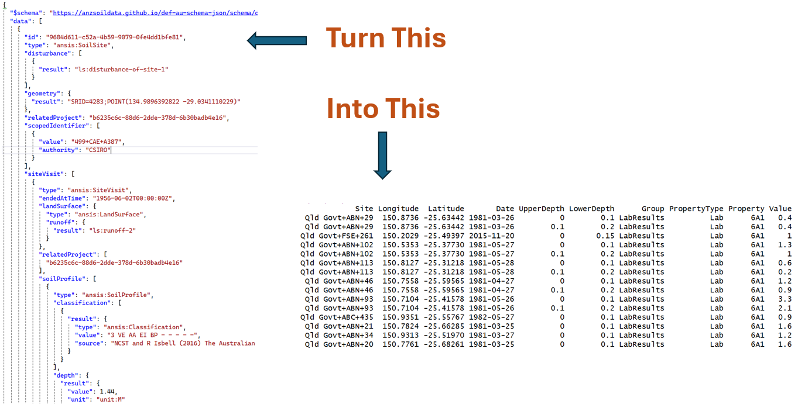

# ANSR

An R package to query ANSIS and massage the responses into various useful formats.

The [Australian National Soil Information System](https://ansis.net/) (ANSIS) brings together a range of publicly available soil profile data sets from across Australia. It delivers data in the form of a standardised JSON Schema preserving complex relationships within the data. This JSON data can be daunting to untangle.

ANSR does all the hard work of querying ANSIS and parsing the JSON response data into simpler formats - mainly CSV files.

## How to Install the package

library(devtools)\
devtools::install_github("RossDSearle/ANSR", auth_token = "YourGitHubAuthToken")

## About ANSR
